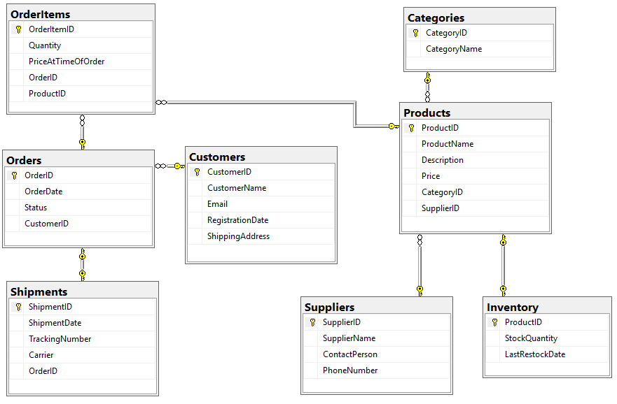

# **End-to-End E-Commerce SQL Database Analysis Project**

This repository showcases a complete, end-to-end data project simulating a real-world e-commerce business. **The project was built entirely from scratch**, covering the full data lifecycle from initial database design and data population to complex analytical querying and final visualization of key business insights.

### **🧠 Motivation & What I Did**

This project was developed as a hands-on exercise to apply and practically demonstrate core data skills. As the sole contributor, **I personally handled every stage of this project's lifecycle**.

The primary goals were to:

* Simulate a real-world business scenario by designing a relational database from the ground up.  
* Apply fundamental and advanced SQL concepts for database creation (DDL), data population (DML), and analytical querying.  
* Extract meaningful, actionable insights from structured data to answer specific business questions.  
* Practice data visualization by representing the SQL findings in a focused Power BI dashboard.

### **🛠️ Technology Stack**

* **Database:** SQL Server  
* **Analysis Language:** T-SQL  
* **Visualization:** Microsoft Power BI  
* **Version Control:** Git & GitHub

### **🧱 The Process: From Design to Insights**

#### **1\. Database Design & Schema**

The project began with architecting a logical and efficient relational database schema. It consists of multiple interconnected tables designed to ensure data integrity, minimize redundancy, and allow for efficient querying.

* **Constraints Used:** PRIMARY KEY, FOREIGN KEY, and CHECK constraints were implemented to maintain data accuracy and enforce business rules.  
* **Data Types & Naming:** Careful consideration was given to data types (e.g., DECIMAL(10,2), INT, VARCHAR), and clear naming conventions (e.g., PriceAtTimeOfOrder) were used.

ER Diagram:  
The full schema and an ER diagram illustrating the relationships between all entities are available in the /Documentation folder.  

DDL Execution Order:  
To successfully recreate the database, the DDL.sql script must be executed in a specific order to respect foreign key dependencies. The correct sequence is outlined within the script's comments.

#### **2\. Data Population**

The database was populated with realistic sample data using the DML.sql script to simulate active business operations.

#### **3\. Data Analysis with SQL**

With the database built and populated, I wrote a series of T-SQL queries to analyze the data and answer key business questions. The full set of queries can be found in the SQL\_Scripts/Queries.sql file.

**Key Business Questions Answered:**

* What is the total number of orders and overall revenue?  
* What are the top-selling products by quantity and revenue?  
* Which product categories generate the most revenue?  
* Which products are low in stock and need immediate restocking?  
* Which customers are inactive and may require re-engagement?

**Sample SQL Query: Top 3 Selling Products**

\-- Get top 3 best-selling products by quantity

SELECT TOP(3) p.ProductID, p.ProductName, SUM(oi.Quantity) AS TotalUnitsSold

FROM Products p

JOIN OrderItems oi ON p.ProductID \= oi.ProductID

GROUP BY p.ProductID, p.ProductName

ORDER BY TotalUnitsSold DESC;

#### **4\. Visualization in Power BI**

The insights from the SQL analysis were visualized in Power BI. A conscious decision was made to create a simple, focused dashboard where each visual directly answers one of the analytical questions. This approach was chosen because the dataset was more suited for targeted insights than sprawling exploration.

The interactive .pbix file and screenshots of all visuals are available in the /Analysis folder.

| Visualization | Business Question Answered |
| :---- | :---- |
| **Pie Chart** | Where does our revenue come from? (Revenue by Category) |
| **Bar Chart** | What are our most popular items? (Top Selling Products) |
| **Card / KPI** | What needs to be restocked immediately? (Low Inventory Alerts) |

### **📁 Repository Structure**

The project files are organized into three main directories for clarity and ease of navigation.

.  
├── Analysis/  
│   ├── Charts.pbix             \# Basic visuals  
│   └── Project\_Visuals/        \# Individual charts  
│  
├── Documentation/  
│   ├── ECommerceDiagram.png    \# The database Entity-Relationship Diagram  
│   └── Project\_Report.md       \# Detailed project report  
│  
└── SQL\_Scripts/  
    ├── DDL.sql                 \# SQL script for table creation (schema)  
    ├── DML.sql                 \# SQL script for data insertion (population)  
    └── Queries.sql             \# All analytical queries
